# AnchovLAB — Self-Managed Linux Server Build

A from-scratch Linux server build demonstrating user/access management, network configuration, LVM storage administration, firewall hardening, and a deployed multi-service application stack (Nginx + PostgreSQL + Flask/Gunicorn) managed entirely through systemd.

Built on Ubuntu Server 24.04 LTS in VirtualBox, starting from a blank VM with no prior configuration.

## Goal

Provision and harden a Linux server end-to-end — covering account security, networking, storage management, service deployment, and automation — to demonstrate practical Linux systems administration skills beyond coursework: provisioning, configuration, troubleshooting, and recovery on a real (if virtualized) system.

## Environment

| Component | Detail |
|---|---|
| Hypervisor | Oracle VirtualBox |
| Guest OS | Ubuntu Server 24.04 LTS (later showed as 26.04 LTS post-upgrade path) |
| Resources | 2 vCPU, 4GB RAM, 25GB primary disk + 10GB secondary disk |
| Network | Bridged adapter, static IP via Netplan |
| Access | SSH (key-based only), administered remotely from a Windows host via PowerShell |

---

## Phase 1: User & Access Management

**Objective:** Replace password-based SSH access with key-based authentication, and disable root login.

### Steps
1. Created a standard admin user and added it to the `sudo` group:
   ```bash
   sudo adduser anchovulab
   sudo usermod -aG sudo anchovulab
   ```
2. Generated an ED25519 SSH key pair on the host (Windows, via PowerShell's OpenSSH client):
   ```powershell
   ssh-keygen -t ed25519 -C "anchovulab-project"
   ```
3. Copied the public key to the VM. (Windows has no native `ssh-copy-id`, so the key was piped manually):
   ```powershell
   Get-Content $env:USERPROFILE\.ssh\id_ed25519.pub | ssh anchovulab@<vm-ip> "mkdir -p ~/.ssh && cat >> ~/.ssh/authorized_keys && chmod 700 ~/.ssh && chmod 600 ~/.ssh/authorized_keys"
   ```
4. Hardened `/etc/ssh/sshd_config`:
   ```
   PermitRootLogin no
   PasswordAuthentication no
   ```
5. Validated config syntax before restarting (`sudo sshd -t`) and restarted the service.

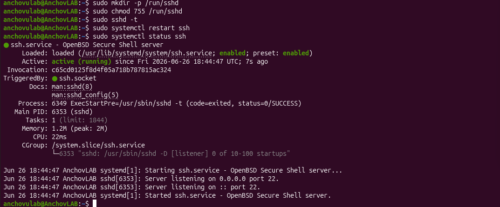

### Verification
- Key-based login succeeded with no password prompt.

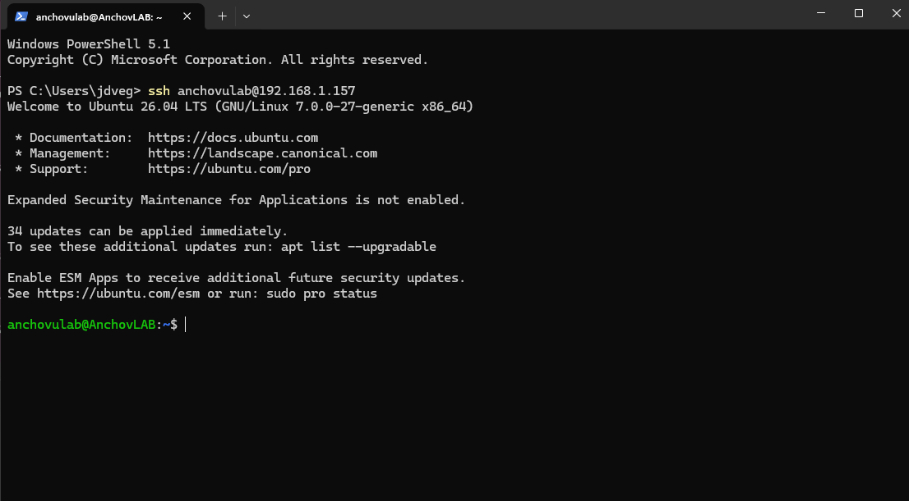

- A forced password-only attempt (`ssh -o PubkeyAuthentication=no ...`) was rejected outright with `Permission denied (publickey)` — proving the password fallback is genuinely disabled, not just deprioritized.

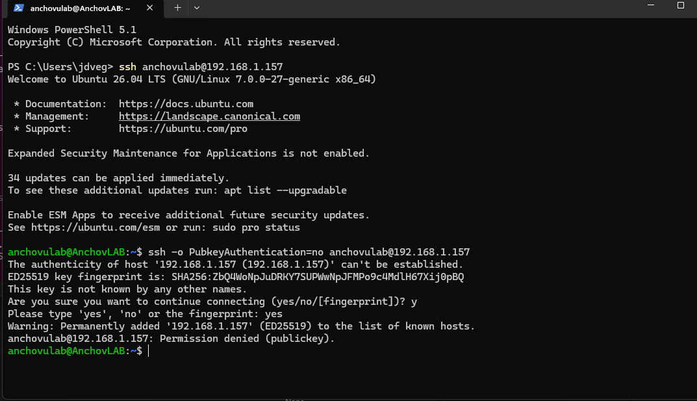

### Issues encountered
- Initial VM network mode was NAT, which isolates the VM from the host — switched to **Bridged Adapter** so the host could reach the VM directly.
- `sshd` failed to restart once with `Missing privilege separation directory: /run/sshd`. Fixed by recreating the directory manually (`/run` is a tmpfs, rebuilt on every boot, and the directory wasn't always recreated automatically):
  ```bash
  sudo mkdir -p /run/sshd
  sudo chmod 755 /run/sshd
  ```

---

## Phase 2: Networking & Firewall

**Objective:** Move off DHCP onto a static IP, and lock down the firewall to a default-deny posture with only required ports open.

### Static IP (Netplan)
Edited `/etc/netplan/00-installer-config.yaml`:
```yaml
network:
  ethernets:
    enp0s3:
      dhcp4: false
      dhcp6: false
      addresses:
        - 192.168.1.157/24
      routes:
        - to: default
          via: 192.168.1.1
      nameservers:
        addresses: [1.1.1.1, 8.8.8.8]
      match:
        macaddress: xx:xx:xx:xx:xx:xx
      set-name: enp0s3
  version: 2
```
Applied safely using `netplan try` (auto-reverts after ~2 minutes if the session drops), confirmed the SSH session survived, then confirmed with `Enter`.

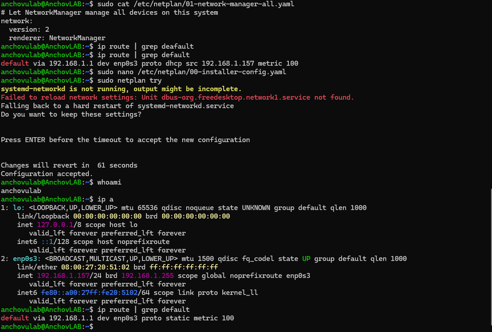

### Firewall (UFW)
```bash
sudo apt install ufw -y
sudo ufw default deny incoming
sudo ufw default allow outgoing
sudo ufw allow 22/tcp
sudo ufw allow 80/tcp
sudo ufw allow 443/tcp
sudo ufw enable
```

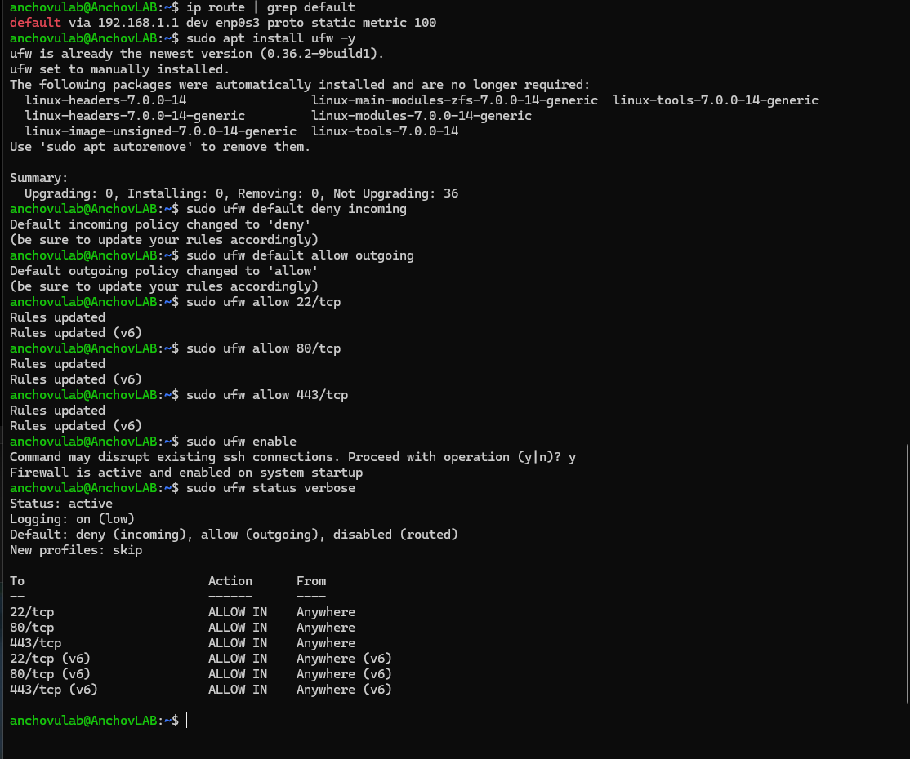

### Verification
- `ip a` / `ip route` confirmed the static IP carried `forever` lease times and `proto static` routing (vs. the prior `dynamic`/`proto dhcp`), proving the assignment was genuinely static, not just a long DHCP lease.
- `nmap` scan immediately after firewall setup (before any services were deployed) showed **only port 22 open** — 80 and 443 were allowed by the firewall but correctly showed closed, since nothing was listening on them yet. This distinction (firewall *allow* vs. service *listening*) is revisited and proven out in Phase 4.

---

## Phase 3: Storage Management (LVM)

**Objective:** Add a second virtual disk and manage it through LVM rather than a raw partition, including a live resize.

### Build
```bash
sudo apt install lvm2 -y
sudo fdisk /dev/sdb        # created partition, set type to 8e (Linux LVM)
sudo pvcreate /dev/sdb1
sudo vgcreate data_vg /dev/sdb1
sudo lvcreate -L 8G -n data_lv data_vg   # left 2GB unallocated for later resize
sudo mkfs.ext4 /dev/data_vg/data_lv
sudo mkdir -p /mnt/data
```

Mounted persistently via `/etc/fstab` (UUID-based, not device-path-based, so the mount survives device renaming):
```
UUID=63abac2b-e270-492c-8c91-2c187e855f6e /mnt/data ext4 defaults 0 2
```

### Live resize
With the volume mounted and in use:
```bash
sudo lvextend -L +1G /dev/data_vg/data_lv
sudo resize2fs /dev/data_vg/data_lv
```
Grew from 7.8G to 8.8G with zero downtime — no unmount, no reboot.

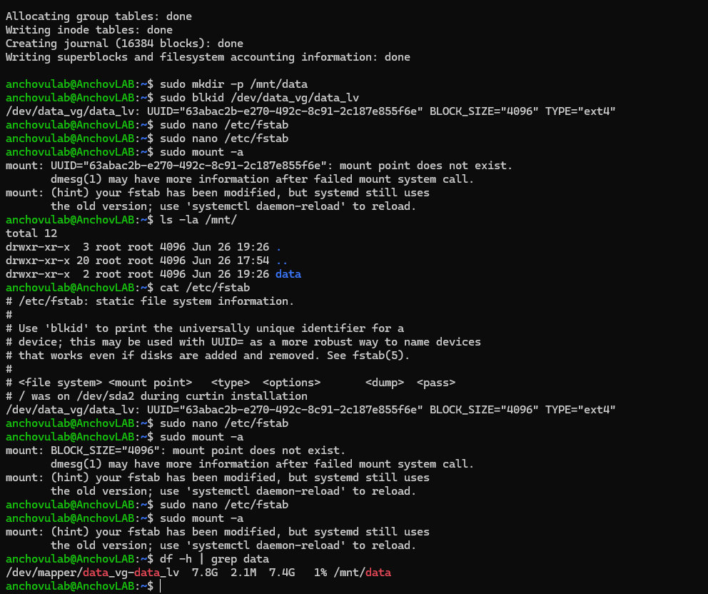

### Verification
- `df -h` before/after resize: `7.8G` → `8.8G`.
- Confirmed the mount survived a full reboot (`df -h | grep data` showed the LVM mount present automatically post-restart, no manual `mount -a` needed).

### Issues encountered
- First `lvextend` attempt reported success (`Size of logical volume ... changed`) but the change **did not actually persist** — `lvdisplay` afterward still showed the old 8GB size. Root cause: the system's root filesystem was mounted read-only at the time, so LVM couldn't write its metadata. See the dedicated section below — this same root-read-only issue recurred across multiple phases and is documented once in full rather than repeated per-phase.
- An `/etc/fstab` line was initially written using raw `blkid` output pasted directly into the file (`UUID="..." BLOCK_SIZE="4096" TYPE="ext4"`), which is not valid fstab syntax — fstab requires six space-separated fields (device, mount point, type, options, dump, pass), not the key=value format `blkid` outputs. Corrected by writing the line manually rather than copy-pasting.

---

## Phase 4: Service Deployment (Nginx + PostgreSQL + Flask/Gunicorn)

**Objective:** Deploy a real, working multi-service application stack, demonstrate the difference between "firewall allows a port" and "a service is actually listening on it," and manage everything through systemd.

### Nginx
```bash
sudo apt install nginx -y
sudo systemctl status nginx   # active (running)
```

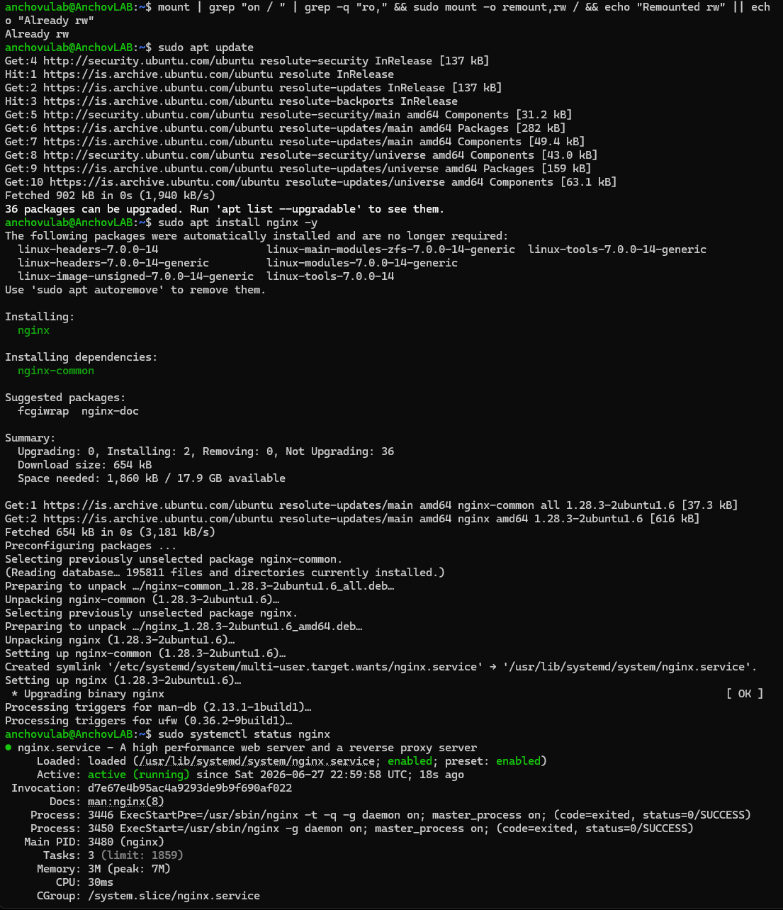

Confirmed reachable from the host browser at `http://<vm-ip>/`:


and confirmed via `nmap` that port 80 flipped from **closed** (Phase 2 baseline) to **open** (Phase 4) — the before/after proof that a firewall rule alone doesn't open a port; a listening service does.

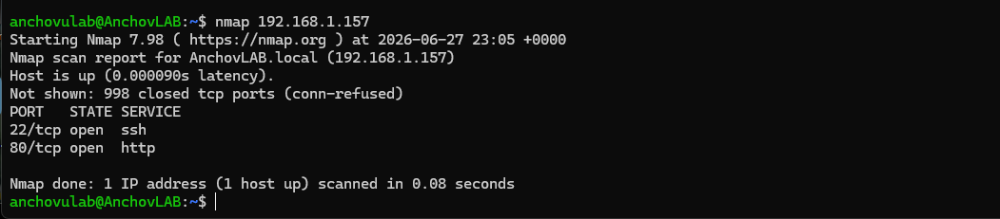

### PostgreSQL
```bash
sudo apt install postgresql postgresql-contrib -y
```
Created a dedicated, non-superuser database and role for the application (never use the `postgres` superuser for app connections):
```sql
CREATE DATABASE labapp;
CREATE USER labapp_user WITH PASSWORD '********';
GRANT ALL PRIVILEGES ON DATABASE labapp TO labapp_user;
GRANT ALL PRIVILEGES ON SCHEMA public TO labapp_user;
```
Note: in PostgreSQL 15+, database-level `GRANT ALL` does **not** automatically include schema-level privileges — the second `GRANT` above is required, or the new user can connect but can't create tables. This was caught and fixed during testing.


Verified by connecting directly as `labapp_user` (not `postgres`) and running a full create/insert/select/drop cycle. The connection negotiated TLS 1.3 automatically (PostgreSQL's secure-by-default behavior on Ubuntu).

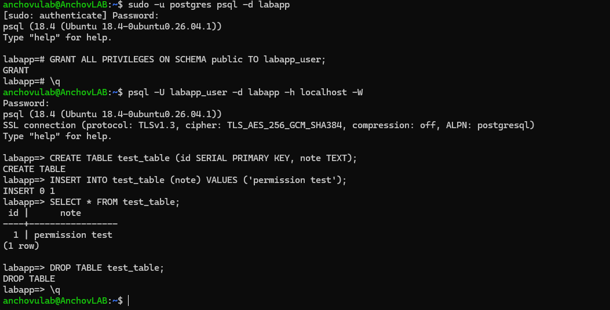

### Application (Flask + Gunicorn)
A minimal Flask app (`/opt/labapp/app.py`) with two routes:
- `/` — health check
- `/visit` — creates a `visits` table if missing, inserts a row, returns a running total

Database credentials are read from an environment variable (`DB_PASSWORD`), not hardcoded in the application file.

Run in production via Gunicorn (not Flask's built-in dev server, which is explicitly unsuitable for production use):
```bash
gunicorn --workers 2 --bind 0.0.0.0:5000 app:app
```

### systemd service
`/etc/systemd/system/labapp.service`:
```ini
[Unit]
Description=Flask Lab App (Gunicorn)
After=network.target postgresql.service

[Service]
User=anchovulab
Group=anchovulab
WorkingDirectory=/opt/labapp
Environment="DB_PASSWORD=********"
ExecStart=/opt/labapp/venv/bin/gunicorn --workers 2 --bind 0.0.0.0:5000 app:app
Restart=always

[Install]
WantedBy=multi-user.target
```
```bash
sudo systemctl daemon-reload
sudo systemctl enable labapp
sudo systemctl start labapp
```

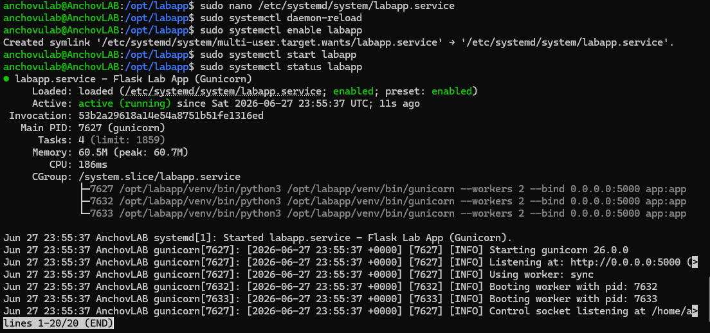

**Note on the credential in the unit file:** storing `DB_PASSWORD` directly in the systemd unit is acceptable for a lab environment but is not a production-grade pattern. In a real deployment this would be sourced from a secrets manager (e.g. Vault, AWS Secrets Manager) or an `.env` file with restricted (`600`) permissions and excluded from version control.

### End-to-end verification
```bash
curl http://<vm-ip>:5000/visit
# {"total_visits":1,"visit_id":1}
# {"total_visits":2,"visit_id":2}
# ...
```

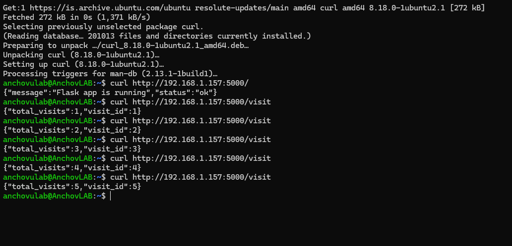

Confirmed the counter incremented correctly across the handoff from Flask's dev server → Gunicorn (manual) → Gunicorn under systemd, with no data loss at any transition.

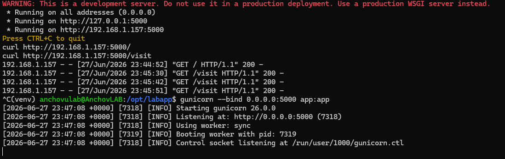

### A real, multi-service failure (and how it was diagnosed)

After a full VM reboot, the application returned HTTP 500 errors. This traced through three layers of cause and effect — a good example of how a single root cause cascades through a service stack:

1. **Symptom:** `curl /visit` returned a 500 Internal Server Error.
2. **First diagnostic step:** `sudo journalctl -u labapp -n 50 --no-pager` showed a full Python traceback ending in:
   ```
   psycopg2.OperationalError: connection to server at "localhost" (127.0.0.1), port 5432 failed: Connection refused
   ```
   → PostgreSQL wasn't accepting connections.
3. **Second diagnostic step:** `sudo systemctl status postgresql@18-main.service` showed `failed (Result: protocol)`, with the underlying error `Could not open logfile /var/log/postgresql/...`.
4. **Root cause:** the system's root filesystem (`/`) was mounted **read-only** immediately after boot — a recurring race condition between `systemd-remount-fs.service` and the storage controller in this VirtualBox configuration. PostgreSQL's startup process tried to write its logfile during this read-only window, failed, and crashed before systemd's later remount-to-`rw` step completed. Because the failure happened at boot before the application was tested, it went unnoticed until the first request was made.
5. **Fix:**
   ```bash
   sudo mount -o remount,rw /
   sudo systemctl start postgresql@18-main.service
   sudo systemctl restart labapp
   ```
6. **Verification:** `curl /visit` returned `total_visits` continuing exactly where it left off pre-reboot — confirming no data loss and full recovery.

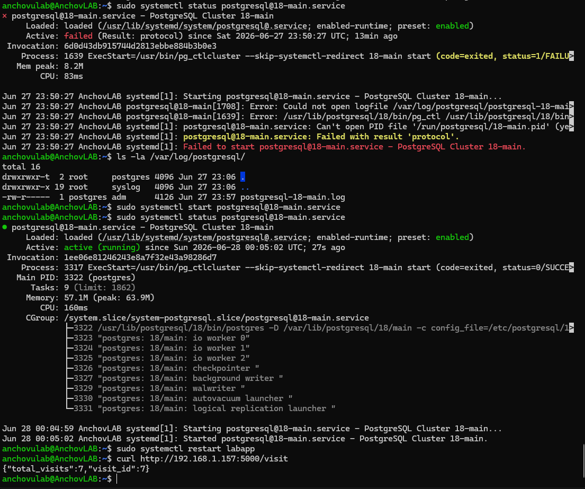

This same root-filesystem race condition was observed on three separate occasions across this project (once during an LVM resize, once during a fresh boot, once during this Phase 4 reboot test). It was diagnosed using a layered approach:
- `mount | grep "on / "` and `/proc/mounts` to confirm live state (more reliable than `systemctl status`, which reported a misleadingly successful remount on at least one occasion)
- `dmesg -T` and `journalctl -k -b` to check for kernel-logged filesystem errors (none were found, ruling out actual disk corruption)
- A direct `touch` test on `/` as the simplest ground-truth check for read-only state

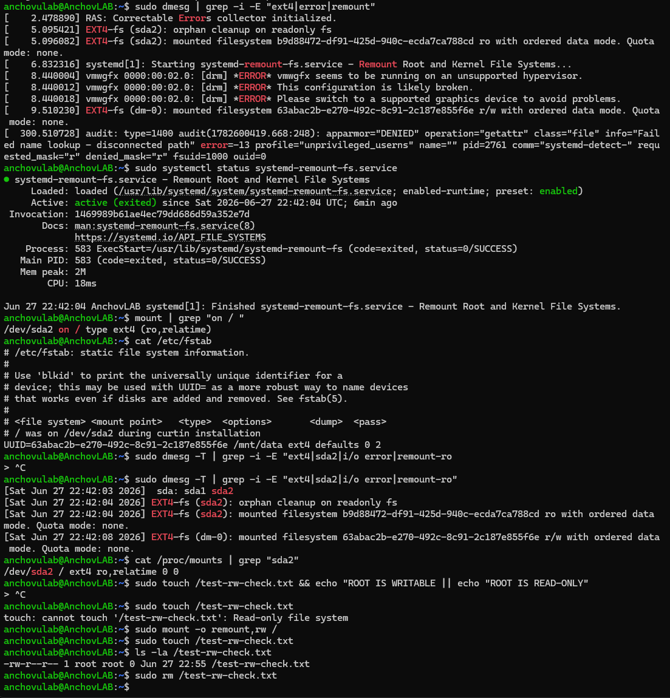

**Standing workaround**, run after every boot before doing further work:
```bash
mount | grep "on / " | grep -q "ro," && sudo mount -o remount,rw / && echo "Remounted rw" || echo "Already rw"
```

A production-grade permanent fix would involve adding an explicit `RequiresMountsFor=` dependency or a startup delay to the affected services so they wait for confirmed read-write root rather than racing the remount step — left undone here intentionally, since demonstrating the diagnosis process was more valuable for this project than silently engineering the symptom away.

---

## Phase 5: Automation & Scripting

**Objective:** Automate backup and monitoring tasks rather than performing them manually — a bash script for application/database backups with retention cleanup, and a Python script for service health monitoring.

### Backup script

`/opt/scripts/backup_labapp.sh`:
```bash
#!/bin/bash
#
# backup_labapp.sh
# Backs up the labapp application files, nginx config, and PostgreSQL database.
# Timestamped archives, 7-day retention, logs all output.

set -euo pipefail

# --- Config ---
BACKUP_DIR="/opt/backups"
APP_DIR="/opt/labapp"
NGINX_CONF="/etc/nginx/sites-available"
DB_NAME="labapp"
DB_USER="labapp_user"
RETENTION_DAYS=7
LOG_FILE="/var/log/labapp_backup.log"
TIMESTAMP=$(date +%Y%m%d_%H%M%S)

mkdir -p "$BACKUP_DIR"

log() {
    echo "[$(date '+%Y-%m-%d %H:%M:%S')] $1" | tee -a "$LOG_FILE"
}

log "=== Starting backup ==="

# --- 1. Archive app + nginx config ---
APP_ARCHIVE="$BACKUP_DIR/labapp_files_$TIMESTAMP.tar.gz"
if tar -czf "$APP_ARCHIVE" -C / opt/labapp etc/nginx/sites-available 2>>"$LOG_FILE"; then
    log "App/web files archived: $APP_ARCHIVE ($(du -h "$APP_ARCHIVE" | cut -f1))"
else
    log "ERROR: App/web file archive failed"
    exit 1
fi

# --- 2. Dump PostgreSQL database ---
DB_DUMP="$BACKUP_DIR/labapp_db_$TIMESTAMP.sql.gz"
if sudo -u postgres pg_dump "$DB_NAME" | gzip > "$DB_DUMP" 2>>"$LOG_FILE"; then
    log "Database dumped: $DB_DUMP ($(du -h "$DB_DUMP" | cut -f1))"
else
    log "ERROR: Database dump failed"
    exit 1
fi

# --- 3. Enforce retention (delete anything older than RETENTION_DAYS) ---
DELETED=$(find "$BACKUP_DIR" -name "labapp_*" -type f -mtime +"$RETENTION_DAYS" -print -delete | wc -l)
log "Retention cleanup: removed $DELETED file(s) older than $RETENTION_DAYS days"

log "=== Backup completed successfully ==="
echo "" >> "$LOG_FILE"
```

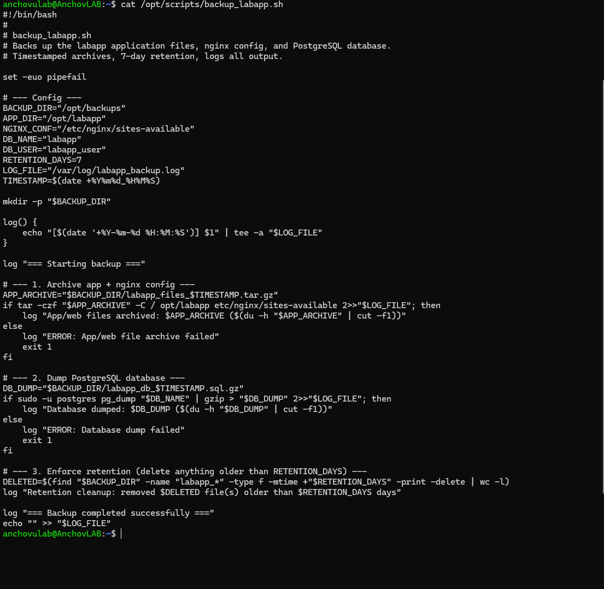

Design notes:
- `set -euo pipefail` exits on any error, undefined variable, or failed pipe step rather than continuing silently.
- `pg_dump` runs as the `postgres` system user via `sudo -u postgres`, matching standard local-trust authentication rather than embedding a password in the script.
- The archive includes the Nginx config alongside the app code, since the web server configuration is just as load-bearing as the application itself for a rebuild.
- Retention cleanup uses `find -mtime +7` (file age), not a file count, so it behaves predictably regardless of backup frequency.

Scheduled via root's crontab to run nightly:
```bash
sudo crontab -e
# 0 2 * * * /opt/scripts/backup_labapp.sh
```

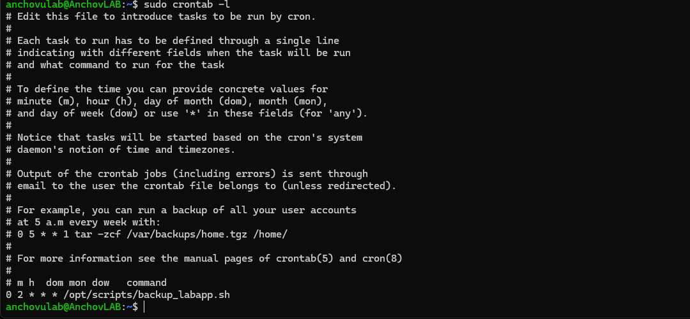

### A real failure caught by the backup script's first run

The first manual run of the backup script surfaced a genuine service failure rather than a clean pass — a second, distinct boot-related issue from the one documented in Phase 4.

1. **Symptom:** the backup script's archive step succeeded, but the database dump step failed outright:
   ```
   pg_dump: error: connection to server on socket "/var/run/postgresql/.s.PGSQL.5432" failed: No such file or directory
   ```
   This means PostgreSQL wasn't listening at all, not a permissions or auth problem.

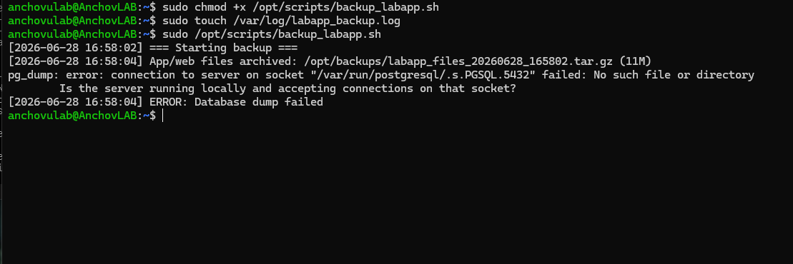

2. **First diagnostic step:** `sudo systemctl status postgresql` reported `active (exited)`, which looked healthy — but this is misleading. On Ubuntu, `postgresql.service` is an umbrella unit (`ExecStart=/bin/true`) that doesn't run the database itself; the real work happens in a versioned instance unit. Checking the actual instance told a different story:
   ```bash
   sudo systemctl status postgresql@18-main
   # Active: failed (Result: protocol)
   ```
   This is the same class of gotcha as the Phase 4 "reported success vs. actual state" lesson — the umbrella unit's status cannot be trusted on its own.

3. **Second diagnostic step:** `sudo journalctl -u postgresql@18-main --no-pager -n 50` showed the underlying error:
   ```
   Could not open logfile /var/log/postgresql/postgresql-18-main.log
   ```
   `pg_ctl start` had exited with status 1 before the database engine itself ever started, because it couldn't open its own startup log.

4. **Root cause:** at the precise moment `postgresql@18-main.service` started during boot, `/var/log` (under root `/`) was not yet writable — consistent with the same systemd-remount race documented in Phase 4, but manifesting differently here: instead of leaving root permanently read-only, the filesystem settled into a normal `rw` state shortly after, while Postgres's one-shot startup attempt had already failed and was never retried. `ls -ld /var/log/postgresql` and a direct writability test (`sudo -u postgres test -w /var/log/postgresql`) both confirmed the directory was fully writable *after* the failure, supporting a timing-based cause rather than a persistent permissions issue.

   Separately, in the same boot, `nginx.service` also failed for an adjacent reason — it couldn't open `/var/log/nginx/error.log` at startup — confirming the write-availability window affected more than one service that boot.

5. **Fix:**
   ```bash
   sudo systemctl restart postgresql@18-main
   sudo systemctl restart nginx
   sudo systemctl restart labapp
   ```
   All three came back healthy; `curl -I http://localhost:5000` returned `200 OK`, and a re-run of the backup script completed successfully, including a valid `pg_dump` (confirmed by inspecting the decompressed dump header).

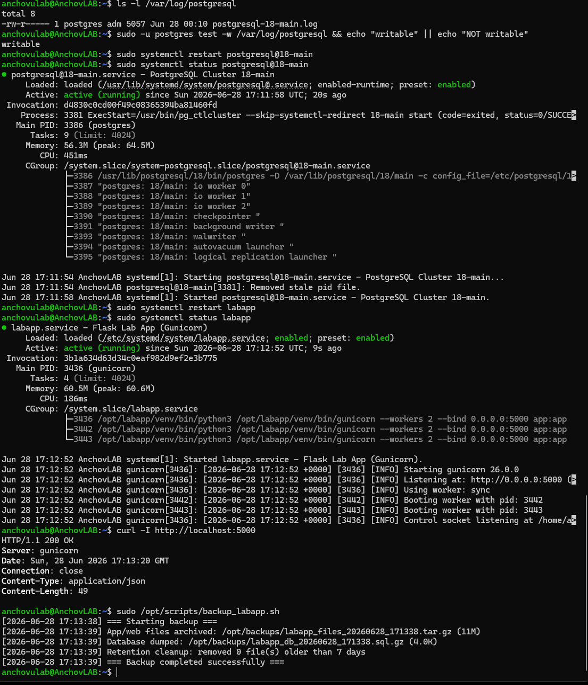

6. **Verification of the original failed dump:** the backup directory was left with two database dump files — a 20-byte file from the failed run, and a proper ~970-byte dump from the post-fix run. Comparing the two directly confirmed the script's own output was an accurate signal of failure versus success, not a false negative.

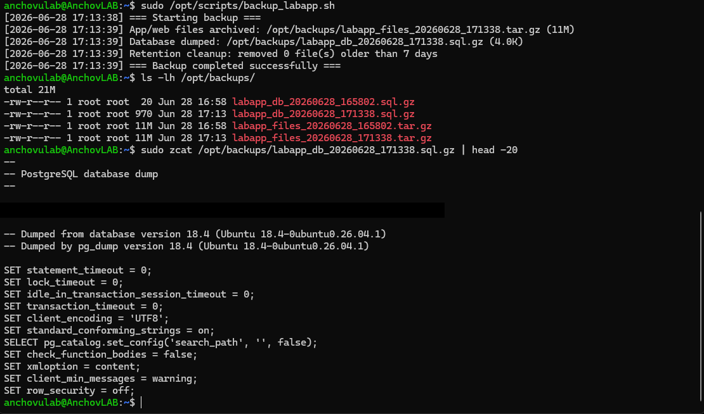

This incident is a useful complement to the Phase 4 write-up: the same underlying boot-timing fragility (filesystem write-availability lagging behind systemd's service-start sequence) produced a different failure signature depending on which service hit it and how that service's `ExecStart` is structured (Postgres's one-shot `pg_ctl start` versus Nginx's log-open-on-launch). It also reinforced why the backup and monitoring scripts in this phase matter beyond automation convenience — the backup script's failure was the first signal that something was wrong, ahead of any manual check.

### Retention logic verification

To confirm the 7-day retention cleanup actually works, without waiting a week, two dummy files were backdated and the script re-run:
```bash
sudo touch -d "10 days ago" /opt/backups/labapp_files_FAKE_OLD.tar.gz
sudo touch -d "10 days ago" /opt/backups/labapp_db_FAKE_OLD.sql.gz
sudo /opt/scripts/backup_labapp.sh
# [...] Retention cleanup: removed 2 file(s) older than 7 days
```
`ls -lh /opt/backups/` before and after confirmed exactly the two backdated files were removed, while all real (non-backdated) backups were retained.

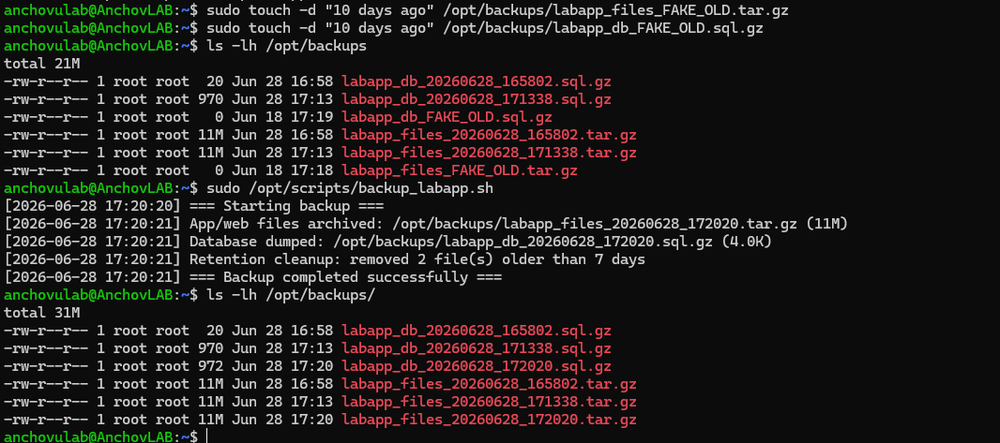

### Monitoring script

`/opt/scripts/monitor_labapp.py`:
```python
#!/usr/bin/env python3
"""
monitor_labapp.py

Checks disk usage and the status of the core AnchovLAB services
(nginx, postgresql, labapp). Logs results, and prints clear ALERT
lines when something needs attention.

Intended to run via cron every few minutes.
"""

import shutil
import subprocess
import sys
from datetime import datetime

# --- Config ---
DISK_PATH = "/"
DISK_THRESHOLD_PCT = 80  # alert if usage goes above this
SERVICES = ["nginx", "postgresql", "labapp"]
LOG_FILE = "/var/log/labapp_monitor.log"


def log(message: str) -> None:
    timestamp = datetime.now().strftime("%Y-%m-%d %H:%M:%S")
    line = f"[{timestamp}] {message}"
    print(line)
    with open(LOG_FILE, "a") as f:
        f.write(line + "\n")


def check_disk_usage() -> bool:
    """Returns True if disk usage is within acceptable bounds."""
    total, used, free = shutil.disk_usage(DISK_PATH)
    used_pct = (used / total) * 100

    if used_pct >= DISK_THRESHOLD_PCT:
        log(f"ALERT: Disk usage on {DISK_PATH} is {used_pct:.1f}% "
            f"(threshold: {DISK_THRESHOLD_PCT}%)")
        return False
    else:
        log(f"OK: Disk usage on {DISK_PATH} is {used_pct:.1f}%")
        return True


def check_service(service: str) -> bool:
    """Returns True if the service is active, False otherwise."""
    result = subprocess.run(
        ["systemctl", "is-active", service],
        capture_output=True,
        text=True,
    )
    status = result.stdout.strip()

    if status == "active":
        log(f"OK: {service} is active")
        return True
    else:
        log(f"ALERT: {service} is '{status}' (expected 'active')")
        return False


def main() -> int:
    log("=== Starting monitoring check ===")

    checks = [check_disk_usage()]
    for service in SERVICES:
        checks.append(check_service(service))

    if all(checks):
        log("=== All checks passed ===")
        return 0
    else:
        log("=== One or more checks FAILED ===")
        return 1


if __name__ == "__main__":
    sys.exit(main())
```

Design notes:
- `shutil.disk_usage` is used instead of shelling out to `df`, avoiding fragile text parsing of command output.
- `systemctl is-active <service>` returns a single clean status word (`active`, `failed`, `inactive`), which is simpler and more reliable to check than parsing full `systemctl status` output.
- The script's exit code (`0` for all-clear, `1` for any failure) lets it integrate cleanly with cron, an email-on-failure wrapper, or a future monitoring tool, without needing to parse log text.

Scheduled to run every 5 minutes via cron:
```cron
*/5 * * * * /usr/bin/python3 /opt/scripts/monitor_labapp.py
```

The first attempt to run the script hit an `IndentationError` on the `if __name__ == "__main__":` guard at the bottom — the line had been added without a body underneath it. Adding `sys.exit(main())` as the actual call fixed it; the version in the listing above is the corrected one.

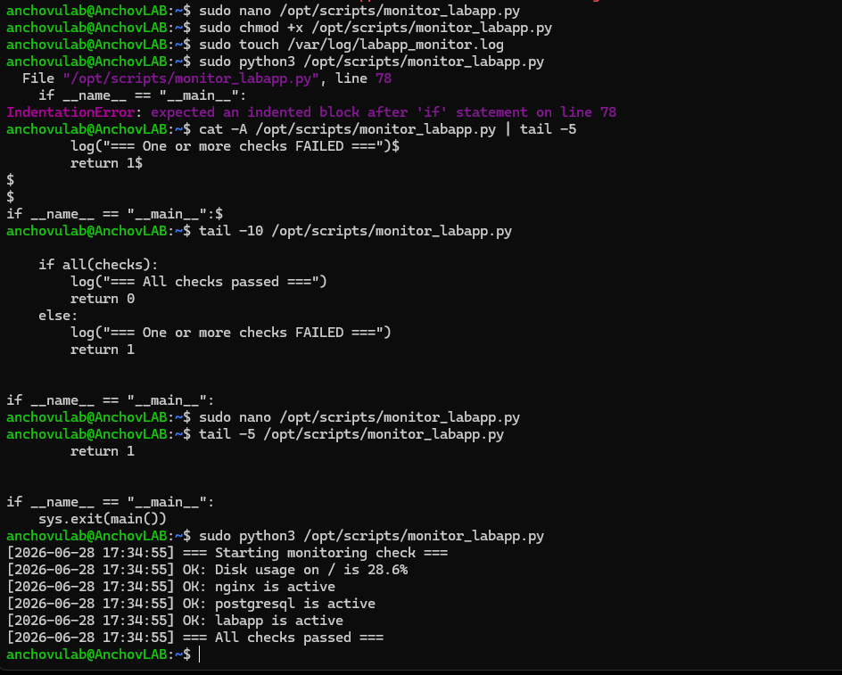

### Monitoring script verification

A baseline run against a fully healthy system confirmed all checks pass cleanly:
```
[2026-06-28 17:34:55] === Starting monitoring check ===
[2026-06-28 17:34:55] OK: Disk usage on / is 28.6%
[2026-06-28 17:34:55] OK: nginx is active
[2026-06-28 17:34:55] OK: postgresql is active
[2026-06-28 17:34:55] OK: labapp is active
[2026-06-28 17:34:55] === All checks passed ===
```

To confirm the alerting logic actually catches a real failure rather than just always reporting success, PostgreSQL was stopped intentionally and the monitor re-run:
```bash
sudo systemctl stop postgresql
sudo python3 /opt/scripts/monitor_labapp.py
```
```
[2026-06-28 17:36:59] === Starting monitoring check ===
[2026-06-28 17:36:59] OK: Disk usage on / is 28.6%
[2026-06-28 17:36:59] OK: nginx is active
[2026-06-28 17:36:59] ALERT: postgresql is 'inactive' (expected 'active')
[2026-06-28 17:36:59] OK: labapp is active
[2026-06-28 17:36:59] === One or more checks FAILED ===
```

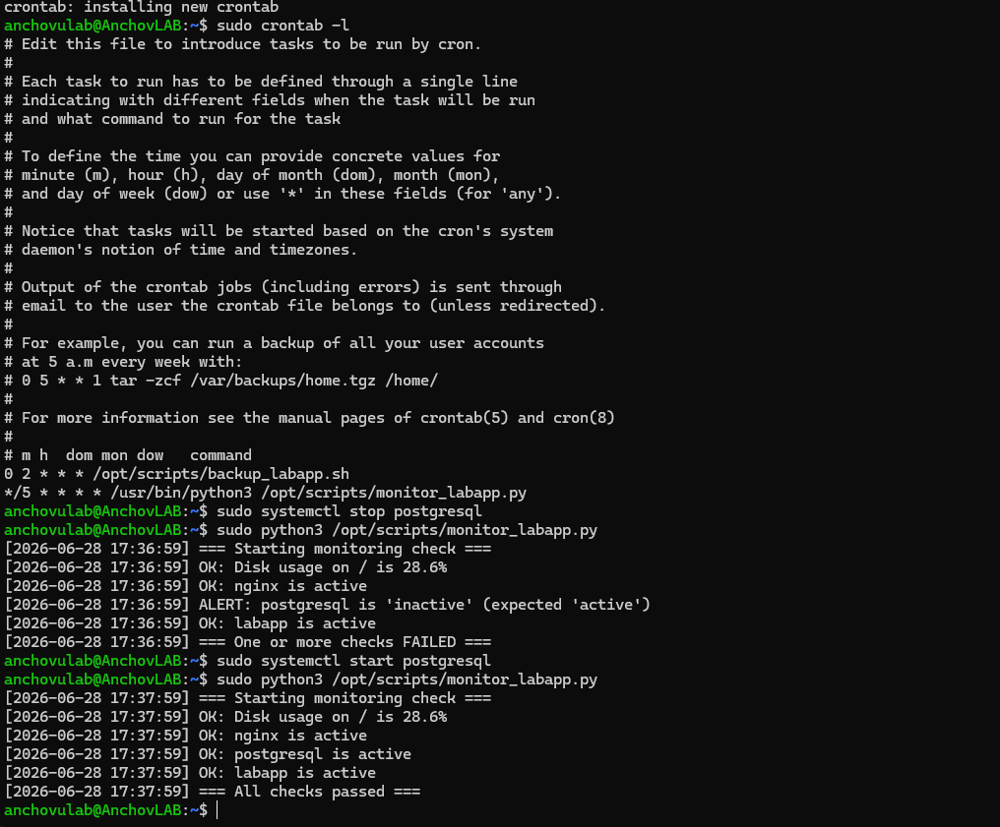

Notably, `labapp` itself still reported `active` even with its database dependency down — Gunicorn doesn't crash just because Postgres is unreachable, it would only surface an error on an actual request. This means the service-status check alone can miss a downstream dependency failure; the monitor caught the real root cause (Postgres down) independently of whether the application had been hit with a request yet, which is a meaningfully different (and earlier) signal than waiting for the app to start erroring.

Restoring the service and re-running confirmed full recovery:
```bash
sudo systemctl start postgresql
sudo python3 /opt/scripts/monitor_labapp.py
```
```
[2026-06-28 17:37:59] === Starting monitoring check ===
[2026-06-28 17:37:59] OK: Disk usage on / is 28.6%
[2026-06-28 17:37:59] OK: nginx is active
[2026-06-28 17:37:59] OK: postgresql is active
[2026-06-28 17:37:59] OK: labapp is active
[2026-06-28 17:37:59] === All checks passed ===
```

---

## Phase 6: Monitoring & Logging

**Objective:** Configure log rotation for the custom application logs introduced in Phase 5, and verify the application's behavior under real load using a proper benchmarking tool rather than assuming it from idle-state testing alone.

### logrotate configuration

`/etc/logrotate.d/labapp`:
```
/var/log/labapp_backup.log /var/log/labapp_monitor.log {
    su root root
    weekly
    rotate 4
    compress
    delaycompress
    missingok
    notifempty
    create 0644 root root
}
```

- `weekly` / `rotate 4` — rotate once a week, keep 4 archived copies (~a month of history) before deleting the oldest.
- `compress` / `delaycompress` — gzip rotated logs to save space, but hold off compressing the most recent rotation by one cycle, so a process that briefly still has the old file open doesn't write into a file mid-compression.
- `missingok` / `notifempty` — don't error if a log doesn't exist yet, and don't rotate a log with nothing in it.
- `create 0644 root root` — recreate an empty log immediately after rotation so the backup/monitor scripts always have somewhere to write.

### Issue encountered: logrotate refused to act on `/var/log`

The first dry run (`sudo logrotate -d /etc/logrotate.d/labapp`) parsed the config correctly but skipped both log files entirely:
```
error: skipping "/var/log/labapp_backup.log" because parent directory has insecure permissions
(It's world writable or writable by group which is not "root")
```

`ls -ld /var/log` showed why: `drwxrwxr-x root syslog` — the `syslog` group has write access on the directory, which is standard, intentional Ubuntu configuration (syslog needs to create and rotate its own logs there), not a misconfiguration. logrotate's safety check flags *any* non-root group write access on a log's parent directory as a potential privilege-escalation vector, regardless of whether that access is legitimate.

The correct fix was **not** to loosen or change `/var/log`'s permissions — that would have broken the legitimate reason `syslog` has write access there. Instead, the `su root root` directive tells logrotate explicitly which user/group to act as, which is the safety check's own suggested resolution: declaring trust for a specific identity rather than having logrotate infer trust from ambient directory permissions.

### Rotation verification

A forced rotation (`sudo logrotate -f /etc/logrotate.d/labapp`) confirmed the full lifecycle:
```bash
sudo logrotate -fv /etc/logrotate.d/labapp
```
```
considering log /var/log/labapp_monitor.log
   log needs rotating
rotating log /var/log/labapp_monitor.log, log->rotateCount is 4
renaming labapp_monitor.log.4.gz to labapp_monitor.log.5.gz
renaming labapp_monitor.log.3.gz to labapp_monitor.log.4.gz
renaming labapp_monitor.log.2.gz to labapp_monitor.log.3.gz
renaming labapp_monitor.log.1.gz to labapp_monitor.log.2.gz
renaming labapp_monitor.log to labapp_monitor.log.1
creating new labapp_monitor.log
```
After running the monitoring script a few more times to generate fresh content and forcing another rotation, the directory listing showed every stage of the lifecycle simultaneously:
```bash
ls -lh /var/log/labapp_monitor.log*
```
```
-rw-r--r-- 1 root root    0 Jun 28 17:58 labapp_monitor.log
-rw-r--r-- 1 root root  574 Jun 28 17:57 labapp_monitor.log.1
-rw-r--r-- 1 root root  156 Jun 28 17:55 labapp_monitor.log.2.gz
-rw-r--r-- 1 root root  322 Jun 28 17:50 labapp_monitor.log.3.gz
```
This confirms every directive working as intended in one view: a fresh empty active log, an uncompressed `.1` (delaycompress), and progressively older, compressed, cascading-renamed archives (`rotate 4` in action).

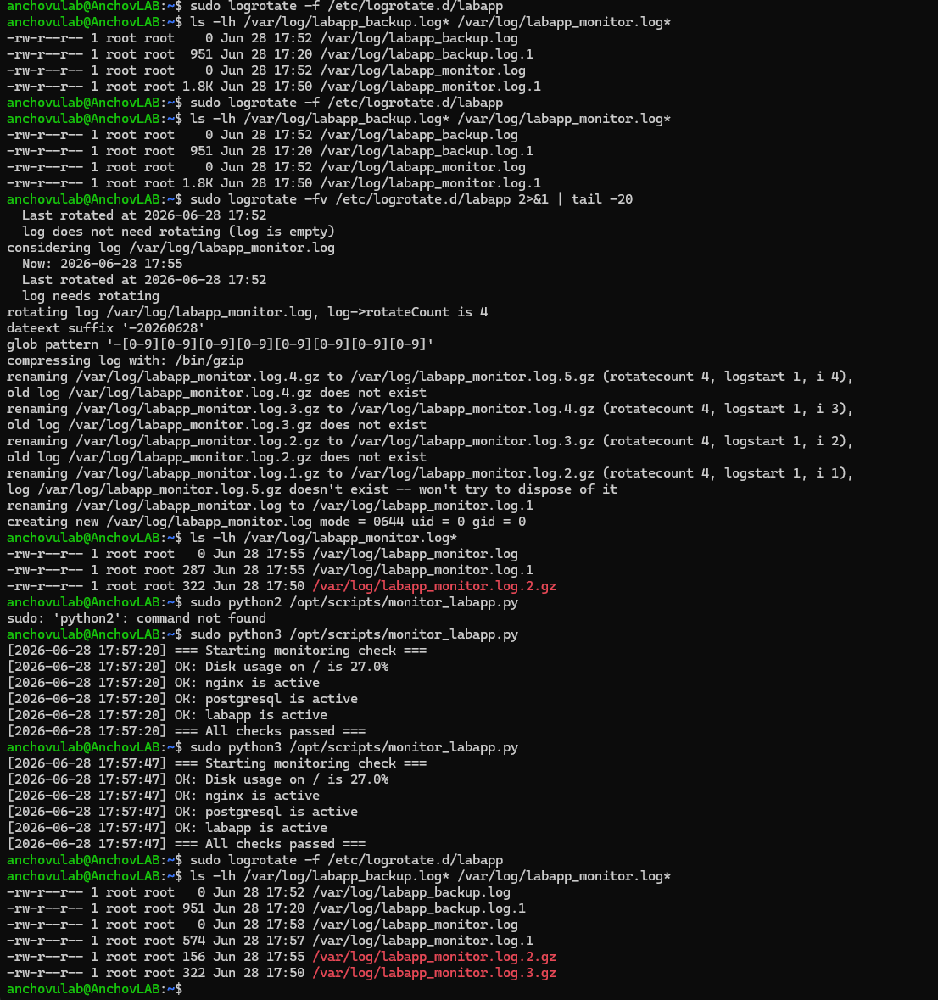

`labapp_backup.log` separately demonstrated `notifempty` correctly: a forced rotation attempted while the log was empty left it untouched (`log is empty`, skipped), proving the directive prevents pointless empty archives rather than just being unused config.

### Load testing and log observation

To observe the application under real concurrent load (rather than only at rest), Apache Bench was installed and run against the running `labapp` service:
```bash
sudo apt install apache2-utils -y
```

An initial test against `/visit` produced a result that needed investigation before it could be trusted:
```bash
ab -n 200 -c 10 http://192.168.1.157:5000/visit
```
```
Complete requests:      200
Failed requests:        138
   (Connect: 0, Receive: 0, Length: 138, Exceptions: 0)
```

138 of 200 requests were flagged "failed," but the failure breakdown pointed specifically at **Length** mismatches, with zero Connect or Receive failures — meaning every request actually connected and received a response; `ab` was only flagging that the response body's byte length didn't match the first response it saw. Since `/visit` returns a running counter (`{"total_visits":N,...}`), the response length legitimately grows as `N` gains digits, which is exactly the kind of endpoint `ab`'s default length-comparison assumption doesn't handle. This was a tooling artifact, not a server-side failure.

To confirm this, the same test was re-run against `/` (a static health-check response, fixed at 49 bytes):
```bash
ab -n 200 -c 10 http://192.168.1.157:5000/
```
```
Failed requests:        0
Requests per second:    3261.05 [#/sec] (mean)
100%                    5 (longest request) [ms]
```
Zero failures, and dramatically lower latency, confirming the original "failures" were entirely a length-mismatch artifact tied to `/visit`'s variable response, not an indication of real instability.

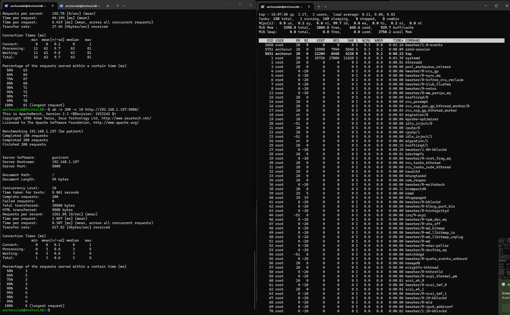

A heavier, sustained test then confirmed the application handles real concurrent load correctly:
```bash
ab -n 5000 -c 30 http://192.168.1.157:5000/visit
```
```
Complete requests:      5000
Failed requests:        4238
   (Connect: 0, Receive: 0, Length: 4238, Exceptions: 0)
Requests per second:    157.27 [#/sec] (mean)
Time taken for tests:   31.792 seconds
```
`Complete requests: 5000` confirms every one of the 5000 requests was actually served; the "failures" were once again entirely Length-based, consistent with the same explanation at greater scale.

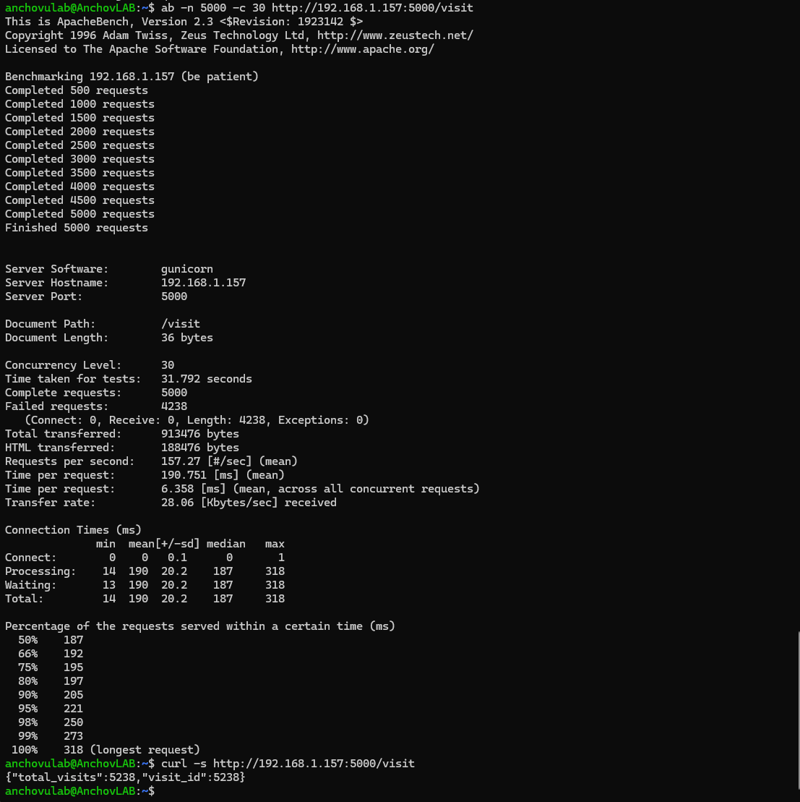

`top`, captured mid-test, showed both Gunicorn workers genuinely saturated under the 30-concurrent-connection load:
```
%Cpu(s): 22.0 us, 29.9 sy, 0.0 ni, 20.1 id, 4.6 wa, 0.0 hi, 23.4 si, 0.0 st

PID   USER     %CPU  %MEM  COMMAND
3443  anchovu+ 27.6  1.4   gunicorn
3442  anchovu+ 27.2  1.4   gunicorn
4029  postgres  5.6  1.0   postgres
```
With only 2 Gunicorn workers configured (per the Phase 4 systemd unit), both were visibly working hard, system idle time dropped to 20%, and PostgreSQL itself showed measurable CPU usage from the per-request writes — a clear, honest picture of where the application's capacity ceiling currently sits.

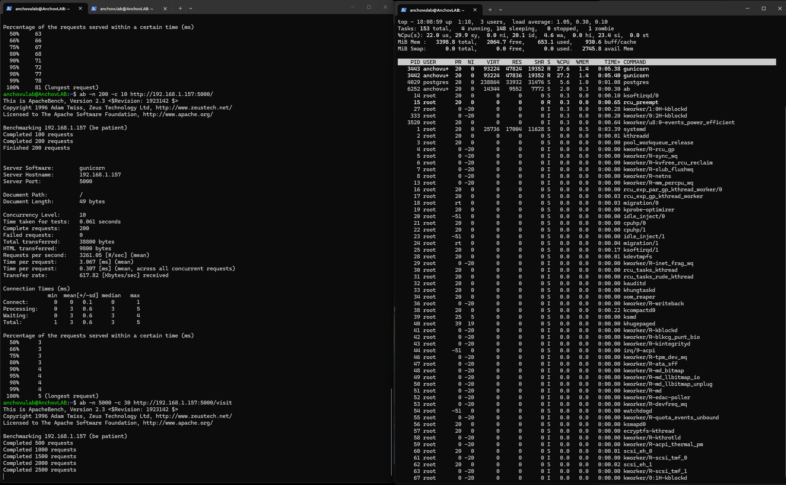

**Counter integrity check.** A `curl` immediately after the 5000-request run returned `{"total_visits":5238,...}`. At first glance this looked higher than expected (5000 requests should only add 5000 to whatever the count was beforehand), which raised the question of whether a race condition was causing double-increments under concurrency. Working backward through the actual `ab` summary (`Complete requests: 5000`, confirming exactly 5000 requests were served, no more) showed the count was simply higher *before* the test started (237, from earlier testing in this phase and Phase 4/5) than initially assumed from a partially scrolled terminal capture. 237 + 5000 + 1 (the verification `curl` itself) = 5238 — an exact match. The increment logic held up correctly even at 30 concurrent connections against a 2-worker pool; there was no race condition, only an initial arithmetic assumption that needed re-checking against the actual data rather than a remembered number.

---

## Phase 7: Security Hardening

**Objective:** Add brute-force protection, automatic security patching, and a general security posture audit on top of the access/network/storage/service work from earlier phases.

### fail2ban — configuration

```bash
sudo apt install fail2ban -y
```

Per fail2ban convention, the default `jail.conf` is never edited directly (it's overwritten on package updates); instead, an override file was created:

`/etc/fail2ban/jail.local`:
```ini
[sshd]
enabled = true
port = 22
filter = sshd
logpath = /var/log/auth.log
maxretry = 5
findtime = 600
bantime = 3600
```

- `maxretry = 5` / `findtime = 600` — ban after 5 failed attempts within a 10-minute window
- `bantime = 3600` — a 1-hour ban

```bash
sudo systemctl enable fail2ban
sudo systemctl restart fail2ban
sudo fail2ban-client status
sudo fail2ban-client status sshd
```

The jail loaded and showed active (`Number of jail: 1`, `Jail list: sshd`), with `Currently failed: 0` / `Currently banned: 0` as an expected clean baseline.

### A real test, a real ban — and a real lockout

To verify the jail actually does something rather than just existing in a healthy-looking state, 6 deliberate failed SSH logins were sent from a separate Windows host using `ssh -o PubkeyAuthentication=no wronguser@<vm-ip>`. The first 5 attempts were rejected normally (`Permission denied (publickey)`); the 6th attempt **timed out** instead of returning a rejection — the signature of a connection being silently dropped by a ban rather than a normal auth failure.

This had an immediate practical consequence: fail2ban bans by **source IP**, not by username or auth outcome. Since the test attempts originated from the same Windows machine used for all legitimate administration of this VM, that machine's IP was banned in its entirety — including the actual working SSH session in progress. The active session was disconnected (`client_loop: send disconnect: Connection reset`), and a follow-up legitimate login attempt from the same host also timed out.

This is a genuinely useful operational lesson, not just an inconvenience: testing brute-force protection from the same host you administer from will lock out your own access along with the test traffic. The VM was recovered via the VirtualBox console (a non-SSH path), which also confirmed that fail2ban's ban list is runtime-only — a VM restart cleared the ban immediately, with no persistent block remaining afterward. In a real deployment, this kind of test should be run either from a disposable/secondary IP, or with the administrator's own IP added to fail2ban's `ignoreip` setting beforehand.

### A second, more fundamental issue: fail2ban crashes on this OS/Python combination

After the VM restart, `fail2ban.service` came back in a **failed** state — not because of the prior ban testing, but due to an unrelated and more serious problem: the service crashes on every single startup attempt.

```bash
sudo systemctl status fail2ban
```
```
Active: failed (Result: exit-code) since [...]
Process: ExecStart=/usr/bin/fail2ban-server -xf start (code=exited, status=255/EXCEPTION)
...
Traceback (most recent call last):
  File "/usr/lib/python3/dist-packages/fail2ban/server/asyncserver.py"
    conn, addr = self.accept()
TypeError: cannot unpack non-iterable NoneType object
```

**Diagnosis:** the traceback points into fail2ban's internal control-socket server, which is built on Python's `asyncore`/`asynchat` modules. Those modules were deprecated in Python 3.6 and formally removed from Python's standard library in Python 3.12 (PEP 594). This system runs **Python 3.14.4** (`python3 --version`) with **fail2ban v1.1.0** (`fail2ban-server --version`) — well past that removal point.

Ubuntu packages a compatibility shim, `python3-pyasyncore`, specifically to keep older software like fail2ban working after the standard-library removal:
```bash
dpkg -l | grep pyasyncore
# ii  python3-pyasyncore  1.0.2-3build1  all  asyncore for Python 3.12 onwards
```
The shim is installed and present — so this isn't a missing-dependency problem. The crash (`self.accept()` returning `None` instead of the expected `(connection, address)` tuple) is a deeper behavioral incompatibility between fail2ban's 15+ year old async networking assumptions and how Python's socket internals behave on a version newer than the shim was originally validated against. A published Ubuntu bug (LP #2055114, "fail2ban is broken in 24.04 Noble") documents the same underlying `asyncore`/`asynchat` removal causing fail2ban failures on Python 3.12; this system's Python 3.14 appears to hit a related but distinct edge case the shim doesn't fully cover.

```bash
apt-cache policy fail2ban
# Installed: 1.1.0-9   Candidate: 1.1.0-9
```
No newer package is available through `apt` — this isn't something fixable by upgrading, at least not through the distribution's repositories.

**Reproducibility check.** Before concluding this was unfixable at this layer, the service was restarted and re-checked to rule out a one-off fluke:
```bash
sudo systemctl restart fail2ban
sleep 3
sudo systemctl status fail2ban
```
The exact same crash occurred again, with the same traceback. This confirms the failure is deterministic and consistently reproducible — a genuine upstream/distribution packaging incompatibility, not an environment-specific flake or a misconfiguration on this VM.

**Outcome:** `jail.local` is correctly configured and was confirmed working during the brute-force test above (it successfully detected and banned the test attempts before this crash was discovered on a later restart), but the service cannot currently run reliably end-to-end on this specific Python/fail2ban version pairing without a fix from either the fail2ban or Ubuntu packaging side. This is documented here as a known, externally-tracked limitation rather than something resolved on this VM — the value demonstrated is in the diagnosis process (reading the traceback to the actual failing line, identifying the Python version boundary involved, confirming the supposed fix package was present and still insufficient, checking for an available package upgrade, and proving reproducibility) rather than in a working end state.

### Replacing fail2ban with sshguard

Since fail2ban can't run reliably on this system's Python version, it was removed cleanly rather than left installed in a broken state:
```bash
sudo systemctl stop fail2ban
sudo systemctl disable fail2ban
```

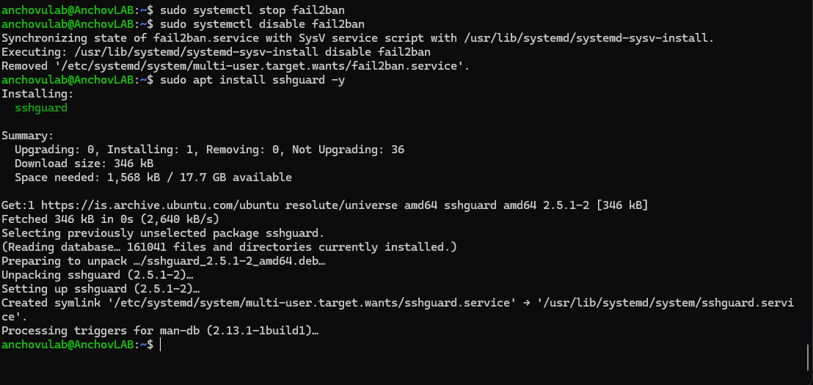

and replaced with `sshguard`, an actively maintained alternative that uses a different architecture entirely: it parses logs directly via `journalctl` rather than tailing a flat log file, and blocks attackers using a dedicated nftables table (`sshg-fw-nft-sets` backend) instead of fail2ban's iptables-chain approach. This isn't just a different tool with the same internals; it's built around the kind of systemd/nftables-native assumptions that fail2ban's `asyncore`-based design predates.

```bash
sudo apt install sshguard -y
sudo systemctl status sshguard
```

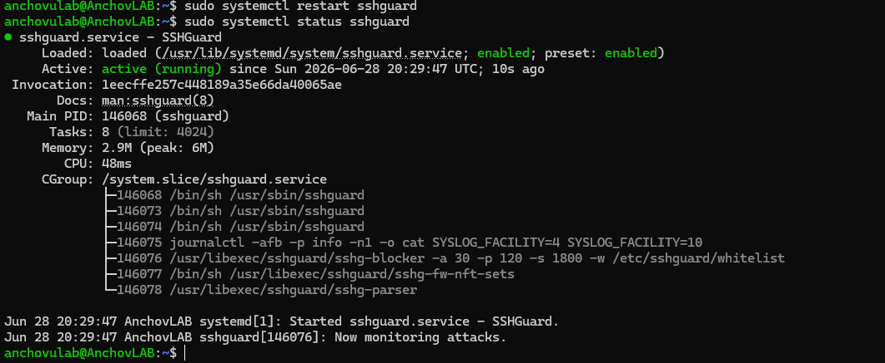

Came up active and running immediately, with a clean process tree: a `sshg-parser` process feeding a `sshg-blocker` decision engine, which calls `sshg-fw-nft-sets` to actually write firewall rules. The blocker's own arguments, visible directly in `systemctl status`, confirmed it had loaded the config correctly: `-a 30 -p 120 -s 1800 -w /etc/sshguard/whitelist` (attack threshold 30, initial block 120 seconds, 1800-second detection window, reading the whitelist file).

**Applying the fail2ban lockout lesson up front.** Before any testing, the administering machine's own IP needed to be in the whitelist, learned directly from the earlier fail2ban incident where testing from the same host used for admin access banned that access along with the test traffic. The default whitelist only covers loopback (`127.0.0.0/8`, `::1/128`), so the real admin IP had to be added explicitly. Found it by checking actual SSH login history rather than guessing:
```bash
sudo journalctl -u ssh --no-pager | grep -i "accepted\|publickey"
```
which consistently showed `192.168.1.83` across every login. Added it:
```bash
echo "192.168.1.83" | sudo tee -a /etc/sshguard/whitelist
sudo systemctl restart sshguard
```

**A real false alarm, and a real diagnostic process to clear it.** After whitelisting and restarting, a few deliberate failed SSH attempts were sent from the whitelisted machine to confirm logging. The `sshguard` systemd journal showed nothing at all, no detection lines, while `sshd`'s own journal clearly showed the failed attempts arriving. This looked like a repeat of the fail2ban situation: a service silently not working. Rather than assuming that, it was checked properly:
1. Confirmed via `man sshguard` that routine "checked and skipped" decisions for whitelisted IPs aren't logged at the default `info` level; that detail only shows at debug verbosity (`SSHGUARD_DEBUG=1`).
2. Ran `sshguard` manually in the foreground with debug output enabled, then repeated the failed attempts. The debug log showed `192.168.1.83: not blocking (on whitelist)` on every cycle — confirming the detection pipeline was working correctly the entire time. The earlier silence wasn't a malfunction; it was correct behavior at normal log verbosity for a whitelisted address.
3. Stopped the foreground debug session and restarted the normal systemd service, then verified via `systemctl status` that a single clean instance came back up with no leftover competing process.

This matters as a documented lesson on its own: an absence of expected log output isn't automatically a failure, and the right response is to check what should be logged at the current verbosity before concluding something is broken.

**Proving an actual block, end to end, from a genuinely different source.** Since the admin machine was now whitelisted, it could no longer be used to test a real ban. A second device on the same LAN (a laptop, IP `192.168.1.3`, confirmed via `ipconfig` to be distinct from the whitelisted `192.168.1.83`) was used to send repeated failed logins:

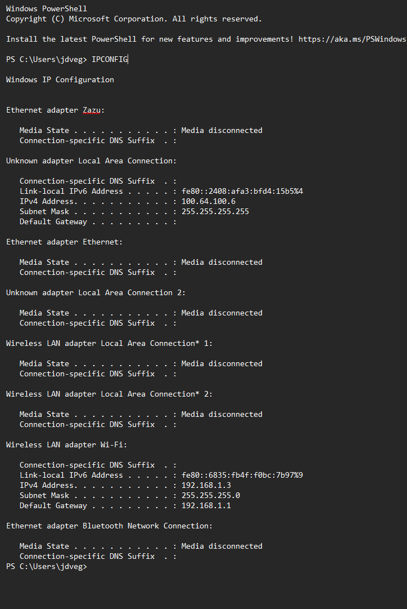

```powershell
ssh -o PubkeyAuthentication=no wronguser@192.168.1.157
```

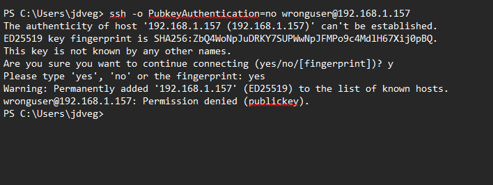

Watching `sudo journalctl -f -u sshguard` live on the VM showed each attempt scored individually:
```
Attack from "192.168.1.3" on service SSH with danger 10.
Attack from "192.168.1.3" on service SSH with danger 2.
```
repeating across several attempts, until the cumulative score crossed the configured threshold:
```
Blocking "192.168.1.3/32" for 120 secs (5 attacks in 137 secs, after 1 abuse over 137 secs.)
```

This was verified at the actual firewall level, not just trusted from the log line, applying the same standard used for fail2ban's misleading "looks fine" states earlier in the project:
```bash
sudo nft list ruleset | grep -A 5 sshguard
```
which showed `192.168.1.3` sitting directly inside the `attackers` set under `table ip sshguard` — a real, live firewall rule, not just a claim in a log file.

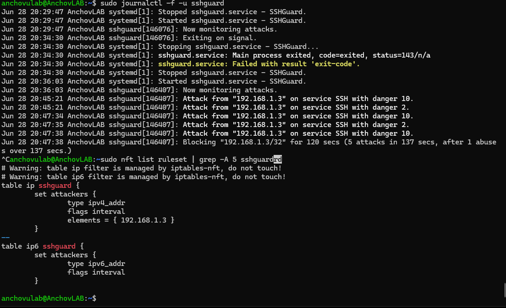

A follow-up SSH attempt from the laptop during the 120-second ban window timed out outright (`Connection timed out`) rather than returning a clean rejection, the same signature fail2ban produced during its working test earlier in this project, confirming the block was genuinely in effect at the network level.


**Outcome:** sshguard is installed, correctly configured, whitelisted for the administering machine, and confirmed working end to end through actual detection, scoring, blocking, and firewall-level verification, with no crash and no manual workaround needed. This directly closes the gap left by fail2ban's incompatibility on this system.

### unattended-upgrades

```bash
sudo apt install unattended-upgrades -y
sudo systemctl status apt-daily.timer
sudo systemctl status apt-daily-upgrade.timer
```

Both timers came back active, confirming the underlying mechanism that triggers daily update checks and upgrades is actually running, not just installed and idle.

Ran a dry run against the real, default security-only configuration:
```bash
sudo unattended-upgrade --dry-run --debug
```
Result: 0 packages eligible. This is the correct outcome, not a failure — at the time of the check, nothing on the system was classified as a pending security update.

To confirm the tool itself works end-to-end (rather than just trusting a 0-package result with no other evidence), a controlled test was run. `/etc/apt/apt.conf.d/50unattended-upgrades` ships with the `-updates` origin commented out by default; this line was temporarily uncommented (not a new addition, just enabling an existing default option) so the dry run would have a larger pool of packages to consider:
```
"${distro_id}:${distro_codename}-updates";
```
Re-running the dry run with this enabled produced a full simulated install walkthrough: dependency resolution, a list of packages that would be installed, and a final "All upgrades installed" success report. This confirmed the tool's install logic actually works, not just its "found nothing to do" path.

The config file was then restored to its original state from a backup taken before the edit:
```bash
sudo cp /etc/apt/apt.conf.d/50unattended-upgrades /etc/apt/apt.conf.d/50unattended-upgrades.bak
# (edit, test)
sudo cp /etc/apt/apt.conf.d/50unattended-upgrades.bak /etc/apt/apt.conf.d/50unattended-upgrades
```
Confirmed the restore was exact with a diff-equivalent check (`cat` comparison against the backup) before moving on, so the system was left in its original, intentional default state rather than with a leftover test change.

### lynis audit — baseline

With fail2ban and unattended-upgrades handled, ran a full system audit to get an objective baseline reading on the overall security posture so far:
```bash
sudo lynis audit system
```

Result:
- **Hardening Index: 67/100**
- 259 tests performed
- 0 warnings
- 46 suggestions

Zero warnings is a meaningful signal on its own — lynis reserves warnings for things it considers actively wrong or risky, separate from suggestions, which are lower-priority hardening opportunities. A clean warning count combined with a moderate suggestion count is a reasonable place to be at this point in the project, with clear room established for targeted improvement.

### Remediation round 1: SSH hardening (SSH-7408)

Lynis flagged several SSH daemon options that go beyond the Phase 1 baseline (key-based auth only, no root login). Edited `/etc/ssh/sshd_config` to add:
```
AllowTcpForwarding no
ClientAliveCountMax 2
LogLevel VERBOSE
MaxAuthTries 3
MaxSessions 3
TCPKeepAlive no
X11Forwarding no
AllowAgentForwarding no
```

`MaxSessions` was deliberately kept at `3` rather than lynis's suggested `2`. This was a judgment call, not an oversight: 3 leaves a small amount of headroom for accidentally overlapping sessions (for example, a dropped connection that hasn't fully closed yet plus a fresh login) without meaningfully widening the attack surface compared to 2.

Safety procedure followed before trusting the change on a remote-administered VM:
1. Validated syntax before touching the running service: `sudo sshd -t` (clean, no output).
2. Restarted the service: `sudo systemctl restart sshd`.
3. Opened a **brand-new** SSH connection from a separate terminal before closing the existing session, to confirm the new config didn't lock out future logins. Only closed the original session after the new one connected successfully.
4. Verified the settings actually took effect at runtime, not just in the config file on disk:
   ```bash
   sudo sshd -T | grep -E "allowtcpforwarding|clientalivecountmax|loglevel|maxauthtries|maxsessions|tcpkeepalive|x11forwarding|allowagentforwarding"
   ```
   All 8 settings matched, with `MaxSessions` confirmed at the deliberate value of `3`, not lynis's suggested `2`.

### Remediation round 2: legal banners (BANN-7126 / BANN-7130)

Lynis flagged the absence of a pre-login warning banner. Added standard legal/authorized-use warning text to both:
- `/etc/issue` (shown before local console login)
- `/etc/issue.net` (shown before SSH login, via `Banner /etc/issue.net` in `sshd_config`)

Confirmed the banner displays on a fresh SSH connection attempt before the login prompt.

### Remediation round 3: package cleanup (PKGS-7346)

Lynis flagged leftover package configuration data from removed packages. A standard cleanup pass:
```bash
sudo apt --purge autoremove -y
```
did not fully clear everything. Checking for remaining "removed but not purged" packages:
```bash
dpkg -l | grep "^rc"
```
showed 3 leftover kernel module package configs still present:
- `linux-image-unsigned-7.0.0-14-generic`
- `linux-main-modules-zfs-7.0.0-14-generic`
- `linux-modules-7.0.0-14-generic`

These are remnants of an older kernel version no longer in use, and `autoremove` doesn't always catch every leftover config for packages tied to a kernel that's already been superseded. Purged them explicitly by name:
```bash
sudo apt purge -y linux-image-unsigned-7.0.0-14-generic linux-main-modules-zfs-7.0.0-14-generic linux-modules-7.0.0-14-generic
```
Re-ran `dpkg -l | grep "^rc"` and got empty output, confirming the cleanup was complete.

### A separate, real issue: apt repository 404s after a regional mirror redirect

While trying to re-run lynis for an after-score, `apt update` started failing:
```
404  Not Found [IP: ...]  http://is.archive.ubuntu.com/ubuntu resolute/main ...
404  Not Found [IP: ...]  http://is.archive.ubuntu.com/ubuntu resolute-updates/main ...
404  Not Found [IP: ...]  http://is.archive.ubuntu.com/ubuntu resolute-backports/main ...
```
Notably, `resolute-security` was **not** affected and continued to update fine. This is a different problem from the recurring read-only-root issue documented earlier in this project, and worth keeping clearly distinct in this writeup rather than assuming it was the same thing again.

**Diagnosis:**
1. Ruled out a codename mismatch first, since that's the most common cause of this kind of error: `VERSION_CODENAME=resolute` in `/etc/os-release` matched exactly what `/etc/apt/sources.list.d/ubuntu.sources` was requesting. Not a mismatch.
2. Compared the global archive against the regional mirror directly for the same Release file path, over plain HTTP:
   ```bash
   curl -sI http://archive.ubuntu.com/ubuntu/dists/resolute/Release
   curl -sI http://is.archive.ubuntu.com/ubuntu/dists/resolute/Release
   ```
   The global archive returned `200 OK`. The regional mirror returned `301 Moved Permanently`, redirecting to the HTTPS version of the same path.
3. Followed that redirect manually:
   ```bash
   curl -sIL http://is.archive.ubuntu.com/ubuntu/dists/resolute/Release
   ```
   The HTTPS version returned `200 OK`, with a `Content-Length` identical to the working global archive response. The file exists and is reachable; it's only the plain-HTTP path to it on this particular mirror that doesn't resolve.

**Root cause:** the regional mirror `is.archive.ubuntu.com` redirects HTTP requests for this codename to HTTPS, but `/etc/apt/sources.list.d/ubuntu.sources` specified `URIs: http://is.archive.ubuntu.com/ubuntu/` (plain HTTP, no `s`). `apt` correctly refuses to silently follow an HTTP→HTTPS redirect when fetching repository metadata, since trusting a redirect target for package data without an explicit configuration change would be a meaningful security weakening, not a convenience. So this isn't a bug in apt: it's apt doing the right, conservative thing in response to a mirror change it wasn't told to expect.

**Fix:**
```bash
sudo cp /etc/apt/sources.list.d/ubuntu.sources /etc/apt/sources.list.d/ubuntu.sources.bak
```
Changed the URI on the affected source block from `http://is.archive.ubuntu.com/ubuntu/` to `https://is.archive.ubuntu.com/ubuntu/`. The `security.ubuntu.com` block was left untouched, since it was already working correctly over plain HTTP and didn't need changing.
```bash
sudo apt update
```
Ran clean, no 404s. Confirmed fixed.

This is a good example of root-causing rather than guessing: the fix wasn't found by trying random things, it came directly out of comparing the working and failing paths side by side and following the actual redirect to see exactly where it led.

### lynis after-score

The first lynis re-run attempted right after discovering the apt 404s was run against a broken repository state and produced misleading "long execution" warnings as a side effect of apt itself failing partway through related checks. That run is discarded and not used as the real after-score.

A clean re-run, with the apt/mirror issue fixed:
```bash
sudo lynis audit system --quiet
```
This run also logged a few "long execution" warnings (`DEB-0001`, `PKGS-7345`, `CRYP-7902`) — these are lynis flagging that specific package/crypto checks took longer than its internal timing threshold, not security findings, and unrelated to the apt/mirror issue from before. They don't affect the score.

Pulled the actual result from the log rather than re-reading the full scrollback:
```bash
sudo grep -A 5 "Hardening index" /var/log/lynis.log
```
```
Hardening index : [74] [###############     ]
Hardening strength: System has been hardened, but could use additional hardening
```

Cross-checked the finding counts directly against the report data file:
```bash
sudo grep -c "^suggestion\[\]" /var/log/lynis-report.dat
sudo grep -c "^warning\[\]" /var/log/lynis-report.dat
```
36 suggestions, 0 warnings. (36 suggestions + 0 warnings = 36 total, which matched a combined grep count run beforehand, confirming the numbers were internally consistent.)

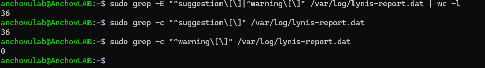

**Before / after:**

| Metric | Baseline | After remediation |
|---|---|---|
| Hardening Index | 67 | 74 |
| Warnings | 0 | 0 |
| Suggestions | 46 | 36 |

A 7-point gain on the Hardening Index and 10 fewer open suggestions, directly attributable to the three remediation rounds documented above (SSH daemon hardening, legal banners, package cleanup) plus getting fail2ban and unattended-upgrades properly configured and tested. Warnings stayed at 0 throughout, meaning nothing actively wrong was introduced or left unresolved at any point in this hardening pass.

---

## Skills Demonstrated

| Area | Specific Skills |
|---|---|
| Access Management | User/group administration, SSH key-based auth, disabling root login and password auth |
| Networking | Static IP configuration (Netplan), firewall configuration and default-deny posture (UFW), network verification (nmap) |
| Storage | LVM (PV/VG/LV), persistent mounts via fstab (UUID-based), live volume resizing with zero downtime |
| Services | Nginx web server, PostgreSQL database administration (dedicated roles, schema permissions, TLS), Python virtual environments |
| Application Deployment | WSGI production deployment (Gunicorn vs. dev server), systemd unit creation and service management |
| Automation & Scripting | Bash scripting (`set -euo pipefail`, error handling, structured logging), Python scripting (stdlib disk/process checks, exit-code-driven status), cron scheduling, retention policy design and testing |
| Monitoring & Logging | logrotate configuration (rotation, compression, retention), diagnosing logrotate's security checks against legitimate group-write permissions, load testing with Apache Bench, interpreting benchmark tool output correctly (distinguishing real failures from tooling artifacts), reading live resource usage (`top`) under concurrent load |
| Security Hardening | fail2ban jail configuration, brute-force testing methodology (and its operational risks), diagnosing a reproducible upstream Python/package version incompatibility down to the failing line of code, distinguishing a real packaging bug from a local misconfiguration, recognizing when an issue requires an upstream fix rather than a local one, replacing a broken tool with a working alternative (sshguard) rather than leaving a gap, nftables-based blocking and direct ruleset verification, distinguishing expected log-verbosity behavior from an actual failure, unattended-upgrades configuration and controlled dry-run testing, lynis security auditing and targeted remediation (SSH daemon hardening, legal banners, package cleanup), diagnosing an apt repository failure via mirror/protocol comparison rather than assumption |
| Troubleshooting | Root-cause tracing across multiple service layers, log analysis (`journalctl`, `dmesg`), distinguishing reported success from actual state, identifying systemd umbrella vs. instance units |

## Next Steps

- Configure Nginx as a reverse proxy in front of Gunicorn (currently the app is reachable directly on `:5000`; routing it through Nginx on `:80` would complete the intended architecture)
- Optional further lynis remediation: GRUB bootloader password (BOOT-5122, with the recovery-access tradeoff that comes with it), a malware scanner like `rkhunter` (HRDN-7230), sysctl hardening (KRNL-6000)
- Optional: rebuild this same project using Ansible to demonstrate infrastructure-as-code
